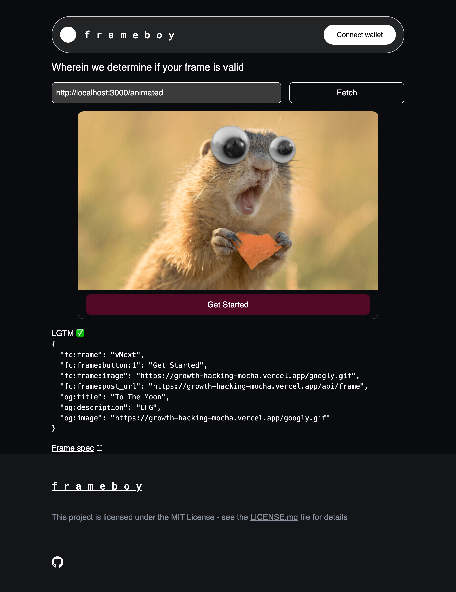

# f r a m e b o y

An implementation of Farcaster frames (and devtools for creating them).

## Status

Very much a work in progress, at the moment it can validate the tags sent on an initial frame visit.

- set `NEXT_PUBLIC_WALLET_CONNECT_PROJECT_ID` in `.env.local` (not used quite yet, but will break the build if absent)
- `yarn` then `yarn dev`
- visit `http://localhost:1337` and input the URL of your frame page. Because it's running locally you can debug the output of a locally running frame.

## Future direction

- [x] Render frame
- [ ] Sign in With Neynar to send authenticated POSTs to frame for realistic testing
- [ ] Build out the full Frameboy app

## Acknowledgements

Built with https://github.com/coinbase/build-onchain-apps
